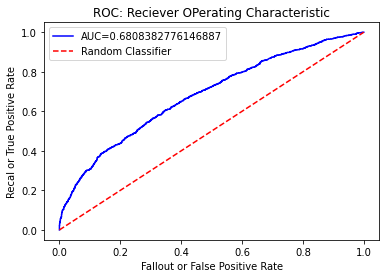

# Credit Card Approval Prediction

Kredit bagi masyarakat bukanlah masalah yang asing, Kredit merupakan salah satu pembiayaan sebagian besar dari kegiatan ekonomi dan sumber dana yang penting untuk setiap jenis usaha. Sebelum dimulainya pemberian kredit kepada nasabah diperlukan suatumengidentifikasi dan memprediksi
 
yang baik 
 
dan seksesama terhadap semua aspek  perkreditan yang dapat menunjang proses pemberian kredit, guna mencegah timbulnyamasalah resiko kredit.Setiap tahunnya industri perbankan mengalami peningkatan nasabah untuk kredit.Maka dari itu dalam menghadapi masalah resiko kredit yang dialami oleh Industri perbankansaat ini salah satunya dapat diatasi dengan mengidentifikasi dan memprediksi nasabahdengan baik sebelum memberikan pinjaman dengan cara memperhatikan data historis pinjaman. Oleh karena itu klasifikasi resiko kredit dalam perbankan memiliki peran yang penting. Apabila pengklasifikasian resiko kredit mengalami kesalahan, maka salah satudampak yang ditimbulkan adalah kredit macet. Kredit macet dapat menyebabkankebangkrutan pada bank

## Import Package yang Dibutuhkan


```python
import numpy as np
import pandas as pd
from scipy import stats
from zipfile import ZipFile
import seaborn as sns
# !pip install imbalanced_learn
from imblearn.over_sampling import SMOTE
from collections import Counter
import matplotlib.pyplot as plt
from sklearn import svm
from sklearn.linear_model import LogisticRegression
from sklearn.model_selection import train_test_split, GridSearchCV
from sklearn.preprocessing import MinMaxScaler, StandardScaler
from sklearn.metrics import confusion_matrix, roc_curve, auc,classification_report, accuracy_score
```

## Load Dataset
Informasi Dataset:


| Jenis | Keterangan | 
| ----------- | :---------: | 
| Sumber | https://www.kaggle.com/rikdifos/credit-card-approval-prediction | 
| Kategori | Layak (0) dan Tidak Layak(1)| 


```python
zip_dir = "./Data/archive.zip"
zip_ref = ZipFile(zip_dir, 'r')
zip_ref
zip_ref.extractall()
zip_ref.close()
```


```python
app_df = pd.read_csv('./Data/application_record.csv')
credit_df = pd.read_csv('./Data/credit_record.csv')
```


```python
app_df.head()
```


<div>
<style scoped>
    .dataframe tbody tr th:only-of-type {
        vertical-align: middle;
    }

    .dataframe tbody tr th {
        vertical-align: top;
    }

    .dataframe thead th {
        text-align: right;
    }
</style>
<table border="1" class="dataframe">
  <thead>
    <tr style="text-align: right;">
      <th></th>
      <th>ID</th>
      <th>CODE_GENDER</th>
      <th>FLAG_OWN_CAR</th>
      <th>FLAG_OWN_REALTY</th>
      <th>CNT_CHILDREN</th>
      <th>AMT_INCOME_TOTAL</th>
      <th>NAME_INCOME_TYPE</th>
      <th>NAME_EDUCATION_TYPE</th>
      <th>NAME_FAMILY_STATUS</th>
      <th>NAME_HOUSING_TYPE</th>
      <th>DAYS_BIRTH</th>
      <th>DAYS_EMPLOYED</th>
      <th>FLAG_MOBIL</th>
      <th>FLAG_WORK_PHONE</th>
      <th>FLAG_PHONE</th>
      <th>FLAG_EMAIL</th>
      <th>OCCUPATION_TYPE</th>
      <th>CNT_FAM_MEMBERS</th>
    </tr>
  </thead>
  <tbody>
    <tr>
      <th>0</th>
      <td>5008804</td>
      <td>M</td>
      <td>Y</td>
      <td>Y</td>
      <td>0</td>
      <td>427500.0</td>
      <td>Working</td>
      <td>Higher education</td>
      <td>Civil marriage</td>
      <td>Rented apartment</td>
      <td>-12005</td>
      <td>-4542</td>
      <td>1</td>
      <td>1</td>
      <td>0</td>
      <td>0</td>
      <td>NaN</td>
      <td>2.0</td>
    </tr>
    <tr>
      <th>1</th>
      <td>5008805</td>
      <td>M</td>
      <td>Y</td>
      <td>Y</td>
      <td>0</td>
      <td>427500.0</td>
      <td>Working</td>
      <td>Higher education</td>
      <td>Civil marriage</td>
      <td>Rented apartment</td>
      <td>-12005</td>
      <td>-4542</td>
      <td>1</td>
      <td>1</td>
      <td>0</td>
      <td>0</td>
      <td>NaN</td>
      <td>2.0</td>
    </tr>
    <tr>
      <th>2</th>
      <td>5008806</td>
      <td>M</td>
      <td>Y</td>
      <td>Y</td>
      <td>0</td>
      <td>112500.0</td>
      <td>Working</td>
      <td>Secondary / secondary special</td>
      <td>Married</td>
      <td>House / apartment</td>
      <td>-21474</td>
      <td>-1134</td>
      <td>1</td>
      <td>0</td>
      <td>0</td>
      <td>0</td>
      <td>Security staff</td>
      <td>2.0</td>
    </tr>
    <tr>
      <th>3</th>
      <td>5008808</td>
      <td>F</td>
      <td>N</td>
      <td>Y</td>
      <td>0</td>
      <td>270000.0</td>
      <td>Commercial associate</td>
      <td>Secondary / secondary special</td>
      <td>Single / not married</td>
      <td>House / apartment</td>
      <td>-19110</td>
      <td>-3051</td>
      <td>1</td>
      <td>0</td>
      <td>1</td>
      <td>1</td>
      <td>Sales staff</td>
      <td>1.0</td>
    </tr>
    <tr>
      <th>4</th>
      <td>5008809</td>
      <td>F</td>
      <td>N</td>
      <td>Y</td>
      <td>0</td>
      <td>270000.0</td>
      <td>Commercial associate</td>
      <td>Secondary / secondary special</td>
      <td>Single / not married</td>
      <td>House / apartment</td>
      <td>-19110</td>
      <td>-3051</td>
      <td>1</td>
      <td>0</td>
      <td>1</td>
      <td>1</td>
      <td>Sales staff</td>
      <td>1.0</td>
    </tr>
  </tbody>
</table>
</div>


## EDA ( Exploratory Data Analysis )

### Data Understanding


```python
# Memuat informasi dari dataset
app_df.info()
```

    <class 'pandas.core.frame.DataFrame'>
    RangeIndex: 438557 entries, 0 to 438556
    Data columns (total 18 columns):
     #   Column               Non-Null Count   Dtype  
    ---  ------               --------------   -----  
     0   ID                   438557 non-null  int64  
     1   CODE_GENDER          438557 non-null  object 
     2   FLAG_OWN_CAR         438557 non-null  object 
     3   FLAG_OWN_REALTY      438557 non-null  object 
     4   CNT_CHILDREN         438557 non-null  int64  
     5   AMT_INCOME_TOTAL     438557 non-null  float64
     6   NAME_INCOME_TYPE     438557 non-null  object 
     7   NAME_EDUCATION_TYPE  438557 non-null  object 
     8   NAME_FAMILY_STATUS   438557 non-null  object 
     9   NAME_HOUSING_TYPE    438557 non-null  object 
     10  DAYS_BIRTH           438557 non-null  int64  
     11  DAYS_EMPLOYED        438557 non-null  int64  
     12  FLAG_MOBIL           438557 non-null  int64  
     13  FLAG_WORK_PHONE      438557 non-null  int64  
     14  FLAG_PHONE           438557 non-null  int64  
     15  FLAG_EMAIL           438557 non-null  int64  
     16  OCCUPATION_TYPE      304354 non-null  object 
     17  CNT_FAM_MEMBERS      438557 non-null  float64
    dtypes: float64(2), int64(8), object(8)
    memory usage: 60.2+ MB
    


```python
# Melihat Statistik dataset
app_df.describe()
```


<div>
<style scoped>
    .dataframe tbody tr th:only-of-type {
        vertical-align: middle;
    }

    .dataframe tbody tr th {
        vertical-align: top;
    }

    .dataframe thead th {
        text-align: right;
    }
</style>
<table border="1" class="dataframe">
  <thead>
    <tr style="text-align: right;">
      <th></th>
      <th>ID</th>
      <th>CNT_CHILDREN</th>
      <th>AMT_INCOME_TOTAL</th>
      <th>DAYS_BIRTH</th>
      <th>DAYS_EMPLOYED</th>
      <th>FLAG_MOBIL</th>
      <th>FLAG_WORK_PHONE</th>
      <th>FLAG_PHONE</th>
      <th>FLAG_EMAIL</th>
      <th>CNT_FAM_MEMBERS</th>
    </tr>
  </thead>
  <tbody>
    <tr>
      <th>count</th>
      <td>4.385570e+05</td>
      <td>438557.000000</td>
      <td>4.385570e+05</td>
      <td>438557.000000</td>
      <td>438557.000000</td>
      <td>438557.0</td>
      <td>438557.000000</td>
      <td>438557.000000</td>
      <td>438557.000000</td>
      <td>438557.000000</td>
    </tr>
    <tr>
      <th>mean</th>
      <td>6.022176e+06</td>
      <td>0.427390</td>
      <td>1.875243e+05</td>
      <td>-15997.904649</td>
      <td>60563.675328</td>
      <td>1.0</td>
      <td>0.206133</td>
      <td>0.287771</td>
      <td>0.108207</td>
      <td>2.194465</td>
    </tr>
    <tr>
      <th>std</th>
      <td>5.716370e+05</td>
      <td>0.724882</td>
      <td>1.100869e+05</td>
      <td>4185.030007</td>
      <td>138767.799647</td>
      <td>0.0</td>
      <td>0.404527</td>
      <td>0.452724</td>
      <td>0.310642</td>
      <td>0.897207</td>
    </tr>
    <tr>
      <th>min</th>
      <td>5.008804e+06</td>
      <td>0.000000</td>
      <td>2.610000e+04</td>
      <td>-25201.000000</td>
      <td>-17531.000000</td>
      <td>1.0</td>
      <td>0.000000</td>
      <td>0.000000</td>
      <td>0.000000</td>
      <td>1.000000</td>
    </tr>
    <tr>
      <th>25%</th>
      <td>5.609375e+06</td>
      <td>0.000000</td>
      <td>1.215000e+05</td>
      <td>-19483.000000</td>
      <td>-3103.000000</td>
      <td>1.0</td>
      <td>0.000000</td>
      <td>0.000000</td>
      <td>0.000000</td>
      <td>2.000000</td>
    </tr>
    <tr>
      <th>50%</th>
      <td>6.047745e+06</td>
      <td>0.000000</td>
      <td>1.607805e+05</td>
      <td>-15630.000000</td>
      <td>-1467.000000</td>
      <td>1.0</td>
      <td>0.000000</td>
      <td>0.000000</td>
      <td>0.000000</td>
      <td>2.000000</td>
    </tr>
    <tr>
      <th>75%</th>
      <td>6.456971e+06</td>
      <td>1.000000</td>
      <td>2.250000e+05</td>
      <td>-12514.000000</td>
      <td>-371.000000</td>
      <td>1.0</td>
      <td>0.000000</td>
      <td>1.000000</td>
      <td>0.000000</td>
      <td>3.000000</td>
    </tr>
    <tr>
      <th>max</th>
      <td>7.999952e+06</td>
      <td>19.000000</td>
      <td>6.750000e+06</td>
      <td>-7489.000000</td>
      <td>365243.000000</td>
      <td>1.0</td>
      <td>1.000000</td>
      <td>1.000000</td>
      <td>1.000000</td>
      <td>20.000000</td>
    </tr>
  </tbody>
</table>
</div>


```python
# melihat jumlah nilai null pada dataset
app_df.isnull().sum()
```


    ID                          0
    CODE_GENDER                 0
    FLAG_OWN_CAR                0
    FLAG_OWN_REALTY             0
    CNT_CHILDREN                0
    AMT_INCOME_TOTAL            0
    NAME_INCOME_TYPE            0
    NAME_EDUCATION_TYPE         0
    NAME_FAMILY_STATUS          0
    NAME_HOUSING_TYPE           0
    DAYS_BIRTH                  0
    DAYS_EMPLOYED               0
    FLAG_MOBIL                  0
    FLAG_WORK_PHONE             0
    FLAG_PHONE                  0
    FLAG_EMAIL                  0
    OCCUPATION_TYPE        134203
    CNT_FAM_MEMBERS             0
    dtype: int64


```python
# Mengecek colom apa saja yang tidak mengandung nilai numerik
cat_columns = app_df.columns[(app_df.dtypes =='object').values].tolist()
cat_columns
```


    ['CODE_GENDER',
     'FLAG_OWN_CAR',
     'FLAG_OWN_REALTY',
     'NAME_INCOME_TYPE',
     'NAME_EDUCATION_TYPE',
     'NAME_FAMILY_STATUS',
     'NAME_HOUSING_TYPE',
     'OCCUPATION_TYPE']


```python
# Mengecek kolom apa saya yang mengandung nilai numerik
app_df.columns[(app_df.dtypes !='object').values].tolist()
```


    ['ID',
     'CNT_CHILDREN',
     'AMT_INCOME_TOTAL',
     'DAYS_BIRTH',
     'DAYS_EMPLOYED',
     'FLAG_MOBIL',
     'FLAG_WORK_PHONE',
     'FLAG_PHONE',
     'FLAG_EMAIL',
     'CNT_FAM_MEMBERS']


```python
# mengecek nilai unik pada kolom non numerik

for i in app_df.columns[(app_df.dtypes =='object').values].tolist():
    print(i,'\n')
    print(app_df[i].value_counts())
    print('-----------------------------------------------')
```

    CODE_GENDER 
    
    F    294440
    M    144117
    Name: CODE_GENDER, dtype: int64
    -----------------------------------------------
    FLAG_OWN_CAR 
    
    N    275459
    Y    163098
    Name: FLAG_OWN_CAR, dtype: int64
    -----------------------------------------------
    FLAG_OWN_REALTY 
    
    Y    304074
    N    134483
    Name: FLAG_OWN_REALTY, dtype: int64
    -----------------------------------------------
    NAME_INCOME_TYPE 
    
    Working                 226104
    Commercial associate    100757
    Pensioner                75493
    State servant            36186
    Student                     17
    Name: NAME_INCOME_TYPE, dtype: int64
    -----------------------------------------------
    NAME_EDUCATION_TYPE 
    
    Secondary / secondary special    301821
    Higher education                 117522
    Incomplete higher                 14851
    Lower secondary                    4051
    Academic degree                     312
    Name: NAME_EDUCATION_TYPE, dtype: int64
    -----------------------------------------------
    NAME_FAMILY_STATUS 
    
    Married                 299828
    Single / not married     55271
    Civil marriage           36532
    Separated                27251
    Widow                    19675
    Name: NAME_FAMILY_STATUS, dtype: int64
    -----------------------------------------------
    NAME_HOUSING_TYPE 
    
    House / apartment      393831
    With parents            19077
    Municipal apartment     14214
    Rented apartment         5974
    Office apartment         3922
    Co-op apartment          1539
    Name: NAME_HOUSING_TYPE, dtype: int64
    -----------------------------------------------
    OCCUPATION_TYPE 
    
    Laborers                 78240
    Core staff               43007
    Sales staff              41098
    Managers                 35487
    Drivers                  26090
    High skill tech staff    17289
    Accountants              15985
    Medicine staff           13520
    Cooking staff             8076
    Security staff            7993
    Cleaning staff            5845
    Private service staff     3456
    Low-skill Laborers        2140
    Secretaries               2044
    Waiters/barmen staff      1665
    Realty agents             1041
    HR staff                   774
    IT staff                   604
    Name: OCCUPATION_TYPE, dtype: int64
    -----------------------------------------------
    


```python
# mengecek nilai unik pada kolom numerik
app_df['CNT_CHILDREN'].value_counts()
```


    0     304071
    1      88527
    2      39884
    3       5430
    4        486
    5        133
    7          9
    9          5
    6          4
    12         4
    14         3
    19         1
    Name: CNT_CHILDREN, dtype: int64


```python
# Melihat nilai max dan min pada kolom "Days_Birth"
print('Min DAYS_BIRTH :', app_df['DAYS_BIRTH'].min(),'\nMax DAYS_BIRTH :', app_df['DAYS_BIRTH'].max())
```

    Min DAYS_BIRTH : -25201 
    Max DAYS_BIRTH : -7489
    


```python
# Mengubah nilai kolom "Days_Birth" dari hari ke tahun
app_df['DAYS_BIRTH'] = round(app_df['DAYS_BIRTH']/-365,0)
app_df.rename(columns={'DAYS_BIRTH':'AGE_YEARS'}, inplace=True)
```


```python
# mengecek nilai unik pada kolom "Days_Employed" yang lebih besar dari 0
app_df[app_df['DAYS_EMPLOYED']>0]['DAYS_EMPLOYED'].unique()
```


    array([365243], dtype=int64)


```python
# Seperti disebutkan dalam dokumen, jika 'DAYS_EMPLOYED' positif tidak, berarti orang tersebut sedang menganggur, maka diganti dengan 0
app_df['DAYS_EMPLOYED'].replace(365243, 0, inplace=True)
```


```python
# Mengonversi nilai 'DAYS_EMPLOYED' dari Hari ke Tahun
app_df['DAYS_EMPLOYED'] = abs(round(app_df['DAYS_EMPLOYED']/-365,0))
app_df.rename(columns={'DAYS_EMPLOYED':'YEARS_EMPLOYED'}, inplace=True)  
```


```python
# Mengecek terdapat nilai apa saja pada kolom "Flag_Mobil"
app_df['FLAG_MOBIL'].value_counts()
```


    1    438557
    Name: FLAG_MOBIL, dtype: int64


```python
# Mengecek terdapat nilai apa saja pada kolom "FLAG_WORK_PHONE"
app_df['FLAG_WORK_PHONE'].value_counts()
```


    0    348156
    1     90401
    Name: FLAG_WORK_PHONE, dtype: int64


```python
# Mengecek terdapat nilai apa saja pada kolom "FLAG_PHONE"
app_df['FLAG_PHONE'].value_counts()
```


    0    312353
    1    126204
    Name: FLAG_PHONE, dtype: int64


```python
# Mengecek terdapat nilai apa saja pada kolom "FLAG_EMAIL"
app_df['FLAG_EMAIL'].value_counts()
```


    0    391102
    1     47455
    Name: FLAG_EMAIL, dtype: int64


```python
# Mengecek terdapat nilai apa saja pada kolom "CNT_FAM_MEMBERS"
app_df['CNT_FAM_MEMBERS'].value_counts()
```


    2.0     233891
    1.0      84492
    3.0      77128
    4.0      37356
    5.0       5081
    6.0        459
    7.0        124
    9.0          9
    11.0         5
    8.0          4
    14.0         4
    15.0         3
    20.0         1
    Name: CNT_FAM_MEMBERS, dtype: int64


```python
app_df.head()
```


<div>
<style scoped>
    .dataframe tbody tr th:only-of-type {
        vertical-align: middle;
    }

    .dataframe tbody tr th {
        vertical-align: top;
    }

    .dataframe thead th {
        text-align: right;
    }
</style>
<table border="1" class="dataframe">
  <thead>
    <tr style="text-align: right;">
      <th></th>
      <th>ID</th>
      <th>CODE_GENDER</th>
      <th>FLAG_OWN_CAR</th>
      <th>FLAG_OWN_REALTY</th>
      <th>CNT_CHILDREN</th>
      <th>AMT_INCOME_TOTAL</th>
      <th>NAME_INCOME_TYPE</th>
      <th>NAME_EDUCATION_TYPE</th>
      <th>NAME_FAMILY_STATUS</th>
      <th>NAME_HOUSING_TYPE</th>
      <th>AGE_YEARS</th>
      <th>YEARS_EMPLOYED</th>
      <th>FLAG_MOBIL</th>
      <th>FLAG_WORK_PHONE</th>
      <th>FLAG_PHONE</th>
      <th>FLAG_EMAIL</th>
      <th>OCCUPATION_TYPE</th>
      <th>CNT_FAM_MEMBERS</th>
    </tr>
  </thead>
  <tbody>
    <tr>
      <th>0</th>
      <td>5008804</td>
      <td>M</td>
      <td>Y</td>
      <td>Y</td>
      <td>0</td>
      <td>427500.0</td>
      <td>Working</td>
      <td>Higher education</td>
      <td>Civil marriage</td>
      <td>Rented apartment</td>
      <td>33.0</td>
      <td>12.0</td>
      <td>1</td>
      <td>1</td>
      <td>0</td>
      <td>0</td>
      <td>NaN</td>
      <td>2.0</td>
    </tr>
    <tr>
      <th>1</th>
      <td>5008805</td>
      <td>M</td>
      <td>Y</td>
      <td>Y</td>
      <td>0</td>
      <td>427500.0</td>
      <td>Working</td>
      <td>Higher education</td>
      <td>Civil marriage</td>
      <td>Rented apartment</td>
      <td>33.0</td>
      <td>12.0</td>
      <td>1</td>
      <td>1</td>
      <td>0</td>
      <td>0</td>
      <td>NaN</td>
      <td>2.0</td>
    </tr>
    <tr>
      <th>2</th>
      <td>5008806</td>
      <td>M</td>
      <td>Y</td>
      <td>Y</td>
      <td>0</td>
      <td>112500.0</td>
      <td>Working</td>
      <td>Secondary / secondary special</td>
      <td>Married</td>
      <td>House / apartment</td>
      <td>59.0</td>
      <td>3.0</td>
      <td>1</td>
      <td>0</td>
      <td>0</td>
      <td>0</td>
      <td>Security staff</td>
      <td>2.0</td>
    </tr>
    <tr>
      <th>3</th>
      <td>5008808</td>
      <td>F</td>
      <td>N</td>
      <td>Y</td>
      <td>0</td>
      <td>270000.0</td>
      <td>Commercial associate</td>
      <td>Secondary / secondary special</td>
      <td>Single / not married</td>
      <td>House / apartment</td>
      <td>52.0</td>
      <td>8.0</td>
      <td>1</td>
      <td>0</td>
      <td>1</td>
      <td>1</td>
      <td>Sales staff</td>
      <td>1.0</td>
    </tr>
    <tr>
      <th>4</th>
      <td>5008809</td>
      <td>F</td>
      <td>N</td>
      <td>Y</td>
      <td>0</td>
      <td>270000.0</td>
      <td>Commercial associate</td>
      <td>Secondary / secondary special</td>
      <td>Single / not married</td>
      <td>House / apartment</td>
      <td>52.0</td>
      <td>8.0</td>
      <td>1</td>
      <td>0</td>
      <td>1</td>
      <td>1</td>
      <td>Sales staff</td>
      <td>1.0</td>
    </tr>
  </tbody>
</table>
</div>


### Data Cleaning

#### Menangani Missing Value
Kolom yang akan kita hapus adalah :
- occupation type : kolom ini dihapus karena banyak sekari terdapat missing value, jadi bisa dibilang kolom ini tidak memiliki peran penting terhadap prediksi yang akan dilakukan
- Flag_mobil : Kolom ini dihapus karena hanya terdapat satu nilai saja
- Flag_work_phone : Kolom ini hanya berisi nilai 0 & 1 untuk Seluler yang tidak dikirimkan, oleh karena itu hapus kolom
- flag_phone : Kolom ini hanya berisi nilai 0 & 1 untuk Seluler yang tidak dikirimkan, oleh karena itu hapus kolom
- flag_email : Kolom ini hanya berisi nilai 0 & 1 untuk email yang tidak dikirimkan, oleh karena itu hapus kolom


```python
app_df.drop('OCCUPATION_TYPE', axis=1, inplace=True)
```


```python
app_df.drop('FLAG_MOBIL', axis=1, inplace=True)
```


```python
app_df.drop('FLAG_WORK_PHONE', axis=1, inplace=True)
```


```python
app_df.drop('FLAG_PHONE', axis=1, inplace=True)
```


```python
app_df.drop('FLAG_EMAIL', axis=1, inplace=True)
```

#### Menangani Outliers
Outliers hanya terjadi pada data numerikal saja


```python
# Mengecek kolom yang berisi nilai numerik
app_df.columns[(app_df.dtypes !='object').values].tolist()
```


    ['ID',
     'CNT_CHILDREN',
     'AMT_INCOME_TOTAL',
     'AGE_YEARS',
     'YEARS_EMPLOYED',
     'CNT_FAM_MEMBERS']


```python
num_cols = ['CNT_CHILDREN',
 'AMT_INCOME_TOTAL',
 'AGE_YEARS',
 'YEARS_EMPLOYED',
 'CNT_FAM_MEMBERS']

plt.figure(figsize=(19,9))
app_df[num_cols].boxplot()
plt.title("Numerical variables in the data", fontsize=20)
plt.show()
```


    

    


```python
# Fungsi Untuk Mendeteksi Outliers
def detect_outlier(data_1):
    outliers=[]
    threshold=3
    mean_1 = np.mean(data_1)
    std_1 =np.std(data_1)
    
    
    for y in data_1:
        z_score= (y - mean_1)/std_1 
        if np.abs(z_score) > threshold:
            outliers.append(y)
    return outliers
```


```python
AMT_outliers = detect_outlier(app_df['AMT_INCOME_TOTAL'])
CNTCh_outliers = detect_outlier(app_df['CNT_CHILDREN'])
YE_outliers = detect_outlier(app_df['YEARS_EMPLOYED'])
CFM_outliers = detect_outlier(app_df['CNT_FAM_MEMBERS'])
print("outliers")
print(f"AMT_INCOME_TOTAL : {len(AMT_outliers)}")
print(f"CNT_CHILDREN: {len(CNTCh_outliers)}")
print(f"YEARS_EMPLOYED : {len(YE_outliers)}")
print(f"CNT_FAM_MEMBERS : {len(CFM_outliers)}")
```

    outliers
    AMT_INCOME_TOTAL : 5276
    CNT_CHILDREN: 6075
    YEARS_EMPLOYED : 9531
    CNT_FAM_MEMBERS : 5690
    


```python
# Fungsi untuk menghapus outliers
def remove_outlier(data):
    z = np.abs(stats.zscore(data))
    threshold = 3
    Q1 = np.percentile(data, 25,
                   interpolation = 'midpoint')
    Q3 = np.percentile(data, 75,
                   interpolation = 'midpoint')
    IQR = Q3 - Q1
    upper = data >= (Q3+1.5*IQR)
     # Below Lower bound
    lower = data <= (Q1-1.5*IQR)
    return data.index[upper]
```


```python
application_df = app_df.copy()
application_df.head()
```


<div>
<style scoped>
    .dataframe tbody tr th:only-of-type {
        vertical-align: middle;
    }

    .dataframe tbody tr th {
        vertical-align: top;
    }

    .dataframe thead th {
        text-align: right;
    }
</style>
<table border="1" class="dataframe">
  <thead>
    <tr style="text-align: right;">
      <th></th>
      <th>ID</th>
      <th>CODE_GENDER</th>
      <th>FLAG_OWN_CAR</th>
      <th>FLAG_OWN_REALTY</th>
      <th>CNT_CHILDREN</th>
      <th>AMT_INCOME_TOTAL</th>
      <th>NAME_INCOME_TYPE</th>
      <th>NAME_EDUCATION_TYPE</th>
      <th>NAME_FAMILY_STATUS</th>
      <th>NAME_HOUSING_TYPE</th>
      <th>AGE_YEARS</th>
      <th>YEARS_EMPLOYED</th>
      <th>CNT_FAM_MEMBERS</th>
    </tr>
  </thead>
  <tbody>
    <tr>
      <th>0</th>
      <td>5008804</td>
      <td>M</td>
      <td>Y</td>
      <td>Y</td>
      <td>0</td>
      <td>427500.0</td>
      <td>Working</td>
      <td>Higher education</td>
      <td>Civil marriage</td>
      <td>Rented apartment</td>
      <td>33.0</td>
      <td>12.0</td>
      <td>2.0</td>
    </tr>
    <tr>
      <th>1</th>
      <td>5008805</td>
      <td>M</td>
      <td>Y</td>
      <td>Y</td>
      <td>0</td>
      <td>427500.0</td>
      <td>Working</td>
      <td>Higher education</td>
      <td>Civil marriage</td>
      <td>Rented apartment</td>
      <td>33.0</td>
      <td>12.0</td>
      <td>2.0</td>
    </tr>
    <tr>
      <th>2</th>
      <td>5008806</td>
      <td>M</td>
      <td>Y</td>
      <td>Y</td>
      <td>0</td>
      <td>112500.0</td>
      <td>Working</td>
      <td>Secondary / secondary special</td>
      <td>Married</td>
      <td>House / apartment</td>
      <td>59.0</td>
      <td>3.0</td>
      <td>2.0</td>
    </tr>
    <tr>
      <th>3</th>
      <td>5008808</td>
      <td>F</td>
      <td>N</td>
      <td>Y</td>
      <td>0</td>
      <td>270000.0</td>
      <td>Commercial associate</td>
      <td>Secondary / secondary special</td>
      <td>Single / not married</td>
      <td>House / apartment</td>
      <td>52.0</td>
      <td>8.0</td>
      <td>1.0</td>
    </tr>
    <tr>
      <th>4</th>
      <td>5008809</td>
      <td>F</td>
      <td>N</td>
      <td>Y</td>
      <td>0</td>
      <td>270000.0</td>
      <td>Commercial associate</td>
      <td>Secondary / secondary special</td>
      <td>Single / not married</td>
      <td>House / apartment</td>
      <td>52.0</td>
      <td>8.0</td>
      <td>1.0</td>
    </tr>
  </tbody>
</table>
</div>


```python

```


```python
application_df.drop(remove_outlier(application_df["CNT_CHILDREN"]), inplace=True)
application_df.drop(remove_outlier(application_df["AMT_INCOME_TOTAL"]), inplace=True)
application_df.drop(remove_outlier(application_df["YEARS_EMPLOYED"]), inplace=True)
application_df.drop(remove_outlier(application_df["CNT_FAM_MEMBERS"]), inplace=True)
```


```python
application_df["AMT_INCOME_TOTAL"].value_counts()
```


    135000.00    43525
    157500.00    36871
    180000.00    35367
    112500.00    34372
    225000.00    31726
                 ...  
    165735.00        1
    109603.35        1
    133461.00        1
    129060.00        1
    167692.50        1
    Name: AMT_INCOME_TOTAL, Length: 725, dtype: int64


```python
num_cols = ['CNT_CHILDREN',
 'AMT_INCOME_TOTAL',
 'AGE_YEARS',
 'YEARS_EMPLOYED',
 'CNT_FAM_MEMBERS']

plt.figure(figsize=(19,9))
application_df[num_cols].boxplot()
plt.title("Numerical variables in the data", fontsize=20)
plt.show()
```


    

    


```python
application_df.head()
```


<div>
<style scoped>
    .dataframe tbody tr th:only-of-type {
        vertical-align: middle;
    }

    .dataframe tbody tr th {
        vertical-align: top;
    }

    .dataframe thead th {
        text-align: right;
    }
</style>
<table border="1" class="dataframe">
  <thead>
    <tr style="text-align: right;">
      <th></th>
      <th>ID</th>
      <th>CODE_GENDER</th>
      <th>FLAG_OWN_CAR</th>
      <th>FLAG_OWN_REALTY</th>
      <th>CNT_CHILDREN</th>
      <th>AMT_INCOME_TOTAL</th>
      <th>NAME_INCOME_TYPE</th>
      <th>NAME_EDUCATION_TYPE</th>
      <th>NAME_FAMILY_STATUS</th>
      <th>NAME_HOUSING_TYPE</th>
      <th>AGE_YEARS</th>
      <th>YEARS_EMPLOYED</th>
      <th>CNT_FAM_MEMBERS</th>
    </tr>
  </thead>
  <tbody>
    <tr>
      <th>2</th>
      <td>5008806</td>
      <td>M</td>
      <td>Y</td>
      <td>Y</td>
      <td>0</td>
      <td>112500.0</td>
      <td>Working</td>
      <td>Secondary / secondary special</td>
      <td>Married</td>
      <td>House / apartment</td>
      <td>59.0</td>
      <td>3.0</td>
      <td>2.0</td>
    </tr>
    <tr>
      <th>3</th>
      <td>5008808</td>
      <td>F</td>
      <td>N</td>
      <td>Y</td>
      <td>0</td>
      <td>270000.0</td>
      <td>Commercial associate</td>
      <td>Secondary / secondary special</td>
      <td>Single / not married</td>
      <td>House / apartment</td>
      <td>52.0</td>
      <td>8.0</td>
      <td>1.0</td>
    </tr>
    <tr>
      <th>4</th>
      <td>5008809</td>
      <td>F</td>
      <td>N</td>
      <td>Y</td>
      <td>0</td>
      <td>270000.0</td>
      <td>Commercial associate</td>
      <td>Secondary / secondary special</td>
      <td>Single / not married</td>
      <td>House / apartment</td>
      <td>52.0</td>
      <td>8.0</td>
      <td>1.0</td>
    </tr>
    <tr>
      <th>5</th>
      <td>5008810</td>
      <td>F</td>
      <td>N</td>
      <td>Y</td>
      <td>0</td>
      <td>270000.0</td>
      <td>Commercial associate</td>
      <td>Secondary / secondary special</td>
      <td>Single / not married</td>
      <td>House / apartment</td>
      <td>52.0</td>
      <td>8.0</td>
      <td>1.0</td>
    </tr>
    <tr>
      <th>6</th>
      <td>5008811</td>
      <td>F</td>
      <td>N</td>
      <td>Y</td>
      <td>0</td>
      <td>270000.0</td>
      <td>Commercial associate</td>
      <td>Secondary / secondary special</td>
      <td>Single / not married</td>
      <td>House / apartment</td>
      <td>52.0</td>
      <td>8.0</td>
      <td>1.0</td>
    </tr>
  </tbody>
</table>
</div>


```python
AMT_outliers = detect_outlier(application_df['AMT_INCOME_TOTAL'])
CNTCh_outliers = detect_outlier(application_df['CNT_CHILDREN'])
YE_outliers = detect_outlier(application_df['YEARS_EMPLOYED'])
CFM_outliers = detect_outlier(application_df['CNT_FAM_MEMBERS'])
print("outliers")
print(f"AMT_INCOME_TOTAL : {len(AMT_outliers)}")
print(f"CNT_CHILDREN: {len(CNTCh_outliers)}")
print(f"YEARS_EMPLOYED : {len(YE_outliers)}")
print(f"CNT_FAM_MEMBERS : {len(CFM_outliers)}")
```

    outliers
    AMT_INCOME_TOTAL : 0
    CNT_CHILDREN: 0
    YEARS_EMPLOYED : 0
    CNT_FAM_MEMBERS : 0
    


```python
application_df.isnull().sum()
```


    ID                     0
    CODE_GENDER            0
    FLAG_OWN_CAR           0
    FLAG_OWN_REALTY        0
    CNT_CHILDREN           0
    AMT_INCOME_TOTAL       0
    NAME_INCOME_TYPE       0
    NAME_EDUCATION_TYPE    0
    NAME_FAMILY_STATUS     0
    NAME_HOUSING_TYPE      0
    AGE_YEARS              0
    YEARS_EMPLOYED         0
    CNT_FAM_MEMBERS        0
    dtype: int64


#### Data Transforming

Transforming Data credit_record.csv


```python
credit_df.head()
```


<div>
<style scoped>
    .dataframe tbody tr th:only-of-type {
        vertical-align: middle;
    }

    .dataframe tbody tr th {
        vertical-align: top;
    }

    .dataframe thead th {
        text-align: right;
    }
</style>
<table border="1" class="dataframe">
  <thead>
    <tr style="text-align: right;">
      <th></th>
      <th>ID</th>
      <th>MONTHS_BALANCE</th>
      <th>STATUS</th>
    </tr>
  </thead>
  <tbody>
    <tr>
      <th>0</th>
      <td>5001711</td>
      <td>0</td>
      <td>X</td>
    </tr>
    <tr>
      <th>1</th>
      <td>5001711</td>
      <td>-1</td>
      <td>0</td>
    </tr>
    <tr>
      <th>2</th>
      <td>5001711</td>
      <td>-2</td>
      <td>0</td>
    </tr>
    <tr>
      <th>3</th>
      <td>5001711</td>
      <td>-3</td>
      <td>0</td>
    </tr>
    <tr>
      <th>4</th>
      <td>5001712</td>
      <td>0</td>
      <td>C</td>
    </tr>
  </tbody>
</table>
</div>


```python
credit_df['STATUS'].value_counts()
```


    C    442031
    0    383120
    X    209230
    1     11090
    5      1693
    2       868
    3       320
    4       223
    Name: STATUS, dtype: int64


```python
# Mengkategorikan kolom 'STATUS' ke klasifikasi biner 0 : Klien Baik dan 1 : klien buruk
credit_df['STATUS'].replace(['C', 'X'],0, inplace=True)
credit_df['STATUS'].replace(['2','3','4','5'],1, inplace=True)
credit_df['STATUS'] = credit_df['STATUS'].astype('int')
```


```python
credit_df.info()
```

    <class 'pandas.core.frame.DataFrame'>
    RangeIndex: 1048575 entries, 0 to 1048574
    Data columns (total 3 columns):
     #   Column          Non-Null Count    Dtype
    ---  ------          --------------    -----
     0   ID              1048575 non-null  int64
     1   MONTHS_BALANCE  1048575 non-null  int64
     2   STATUS          1048575 non-null  int32
    dtypes: int32(1), int64(2)
    memory usage: 20.0 MB
    


```python
credit_df['STATUS'].value_counts(normalize=True)*100
```


    0    98.646353
    1     1.353647
    Name: STATUS, dtype: float64


```python
credit_df_trans = credit_df.groupby('ID').agg(max).reset_index()
```


```python
credit_df_trans.drop('MONTHS_BALANCE', axis=1, inplace=True)
credit_df_trans.head()
```


<div>
<style scoped>
    .dataframe tbody tr th:only-of-type {
        vertical-align: middle;
    }

    .dataframe tbody tr th {
        vertical-align: top;
    }

    .dataframe thead th {
        text-align: right;
    }
</style>
<table border="1" class="dataframe">
  <thead>
    <tr style="text-align: right;">
      <th></th>
      <th>ID</th>
      <th>STATUS</th>
    </tr>
  </thead>
  <tbody>
    <tr>
      <th>0</th>
      <td>5001711</td>
      <td>0</td>
    </tr>
    <tr>
      <th>1</th>
      <td>5001712</td>
      <td>0</td>
    </tr>
    <tr>
      <th>2</th>
      <td>5001713</td>
      <td>0</td>
    </tr>
    <tr>
      <th>3</th>
      <td>5001714</td>
      <td>0</td>
    </tr>
    <tr>
      <th>4</th>
      <td>5001715</td>
      <td>0</td>
    </tr>
  </tbody>
</table>
</div>


```python
credit_df_trans['STATUS'].value_counts(normalize=True)*100
```


    0    88.365771
    1    11.634229
    Name: STATUS, dtype: float64


##### Merging Dataframe


```python
# menggabungkan dua set data berdasarkan 'ID'
final_df = pd.merge(application_df, credit_df_trans, on='ID', how='inner')
final_df.head()
```


<div>
<style scoped>
    .dataframe tbody tr th:only-of-type {
        vertical-align: middle;
    }

    .dataframe tbody tr th {
        vertical-align: top;
    }

    .dataframe thead th {
        text-align: right;
    }
</style>
<table border="1" class="dataframe">
  <thead>
    <tr style="text-align: right;">
      <th></th>
      <th>ID</th>
      <th>CODE_GENDER</th>
      <th>FLAG_OWN_CAR</th>
      <th>FLAG_OWN_REALTY</th>
      <th>CNT_CHILDREN</th>
      <th>AMT_INCOME_TOTAL</th>
      <th>NAME_INCOME_TYPE</th>
      <th>NAME_EDUCATION_TYPE</th>
      <th>NAME_FAMILY_STATUS</th>
      <th>NAME_HOUSING_TYPE</th>
      <th>AGE_YEARS</th>
      <th>YEARS_EMPLOYED</th>
      <th>CNT_FAM_MEMBERS</th>
      <th>STATUS</th>
    </tr>
  </thead>
  <tbody>
    <tr>
      <th>0</th>
      <td>5008806</td>
      <td>M</td>
      <td>Y</td>
      <td>Y</td>
      <td>0</td>
      <td>112500.0</td>
      <td>Working</td>
      <td>Secondary / secondary special</td>
      <td>Married</td>
      <td>House / apartment</td>
      <td>59.0</td>
      <td>3.0</td>
      <td>2.0</td>
      <td>0</td>
    </tr>
    <tr>
      <th>1</th>
      <td>5008808</td>
      <td>F</td>
      <td>N</td>
      <td>Y</td>
      <td>0</td>
      <td>270000.0</td>
      <td>Commercial associate</td>
      <td>Secondary / secondary special</td>
      <td>Single / not married</td>
      <td>House / apartment</td>
      <td>52.0</td>
      <td>8.0</td>
      <td>1.0</td>
      <td>0</td>
    </tr>
    <tr>
      <th>2</th>
      <td>5008809</td>
      <td>F</td>
      <td>N</td>
      <td>Y</td>
      <td>0</td>
      <td>270000.0</td>
      <td>Commercial associate</td>
      <td>Secondary / secondary special</td>
      <td>Single / not married</td>
      <td>House / apartment</td>
      <td>52.0</td>
      <td>8.0</td>
      <td>1.0</td>
      <td>0</td>
    </tr>
    <tr>
      <th>3</th>
      <td>5008810</td>
      <td>F</td>
      <td>N</td>
      <td>Y</td>
      <td>0</td>
      <td>270000.0</td>
      <td>Commercial associate</td>
      <td>Secondary / secondary special</td>
      <td>Single / not married</td>
      <td>House / apartment</td>
      <td>52.0</td>
      <td>8.0</td>
      <td>1.0</td>
      <td>0</td>
    </tr>
    <tr>
      <th>4</th>
      <td>5008811</td>
      <td>F</td>
      <td>N</td>
      <td>Y</td>
      <td>0</td>
      <td>270000.0</td>
      <td>Commercial associate</td>
      <td>Secondary / secondary special</td>
      <td>Single / not married</td>
      <td>House / apartment</td>
      <td>52.0</td>
      <td>8.0</td>
      <td>1.0</td>
      <td>0</td>
    </tr>
  </tbody>
</table>
</div>


```python
final_df.shape
```


    (32416, 14)


```python
# menghapus kolom 'ID' karena hanya memiliki nilai unik (tidak diperlukan untuk Model ML)
final_df.drop('ID', axis=1, inplace=True)
```


```python
# menghapus record yang duplikat
final_df = final_df.drop_duplicates()
final_df.reset_index(drop=True ,inplace=True)
```


```python
final_df.shape
```


    (9888, 13)


```python
final_df.isnull().sum()
```


    CODE_GENDER            0
    FLAG_OWN_CAR           0
    FLAG_OWN_REALTY        0
    CNT_CHILDREN           0
    AMT_INCOME_TOTAL       0
    NAME_INCOME_TYPE       0
    NAME_EDUCATION_TYPE    0
    NAME_FAMILY_STATUS     0
    NAME_HOUSING_TYPE      0
    AGE_YEARS              0
    YEARS_EMPLOYED         0
    CNT_FAM_MEMBERS        0
    STATUS                 0
    dtype: int64


```python
final_df['STATUS'].value_counts(normalize=True)*100
```


    0    78.701456
    1    21.298544
    Name: STATUS, dtype: float64


```python
# Mengonversi semua Kolom Non-Numerik ke Numerik
from sklearn.preprocessing import LabelEncoder

for col in cat_columns:
    if col != "OCCUPATION_TYPE":
        globals()['LE_{}'.format(col)] = LabelEncoder()
        final_df[col] = globals()['LE_{}'.format(col)].fit_transform(final_df[col])
final_df.head()  
```


<div>
<style scoped>
    .dataframe tbody tr th:only-of-type {
        vertical-align: middle;
    }

    .dataframe tbody tr th {
        vertical-align: top;
    }

    .dataframe thead th {
        text-align: right;
    }
</style>
<table border="1" class="dataframe">
  <thead>
    <tr style="text-align: right;">
      <th></th>
      <th>CODE_GENDER</th>
      <th>FLAG_OWN_CAR</th>
      <th>FLAG_OWN_REALTY</th>
      <th>CNT_CHILDREN</th>
      <th>AMT_INCOME_TOTAL</th>
      <th>NAME_INCOME_TYPE</th>
      <th>NAME_EDUCATION_TYPE</th>
      <th>NAME_FAMILY_STATUS</th>
      <th>NAME_HOUSING_TYPE</th>
      <th>AGE_YEARS</th>
      <th>YEARS_EMPLOYED</th>
      <th>CNT_FAM_MEMBERS</th>
      <th>STATUS</th>
    </tr>
  </thead>
  <tbody>
    <tr>
      <th>0</th>
      <td>1</td>
      <td>1</td>
      <td>1</td>
      <td>0</td>
      <td>112500.0</td>
      <td>4</td>
      <td>4</td>
      <td>1</td>
      <td>1</td>
      <td>59.0</td>
      <td>3.0</td>
      <td>2.0</td>
      <td>0</td>
    </tr>
    <tr>
      <th>1</th>
      <td>0</td>
      <td>0</td>
      <td>1</td>
      <td>0</td>
      <td>270000.0</td>
      <td>0</td>
      <td>4</td>
      <td>3</td>
      <td>1</td>
      <td>52.0</td>
      <td>8.0</td>
      <td>1.0</td>
      <td>0</td>
    </tr>
    <tr>
      <th>2</th>
      <td>0</td>
      <td>0</td>
      <td>1</td>
      <td>0</td>
      <td>283500.0</td>
      <td>1</td>
      <td>1</td>
      <td>2</td>
      <td>1</td>
      <td>62.0</td>
      <td>0.0</td>
      <td>1.0</td>
      <td>0</td>
    </tr>
    <tr>
      <th>3</th>
      <td>1</td>
      <td>1</td>
      <td>1</td>
      <td>0</td>
      <td>270000.0</td>
      <td>4</td>
      <td>1</td>
      <td>1</td>
      <td>1</td>
      <td>46.0</td>
      <td>2.0</td>
      <td>2.0</td>
      <td>0</td>
    </tr>
    <tr>
      <th>4</th>
      <td>1</td>
      <td>1</td>
      <td>1</td>
      <td>0</td>
      <td>135000.0</td>
      <td>0</td>
      <td>4</td>
      <td>1</td>
      <td>1</td>
      <td>49.0</td>
      <td>3.0</td>
      <td>2.0</td>
      <td>0</td>
    </tr>
  </tbody>
</table>
</div>


#### Data Visualization


```python
final_df.head()
```


<div>
<style scoped>
    .dataframe tbody tr th:only-of-type {
        vertical-align: middle;
    }

    .dataframe tbody tr th {
        vertical-align: top;
    }

    .dataframe thead th {
        text-align: right;
    }
</style>
<table border="1" class="dataframe">
  <thead>
    <tr style="text-align: right;">
      <th></th>
      <th>CODE_GENDER</th>
      <th>FLAG_OWN_CAR</th>
      <th>FLAG_OWN_REALTY</th>
      <th>CNT_CHILDREN</th>
      <th>AMT_INCOME_TOTAL</th>
      <th>NAME_INCOME_TYPE</th>
      <th>NAME_EDUCATION_TYPE</th>
      <th>NAME_FAMILY_STATUS</th>
      <th>NAME_HOUSING_TYPE</th>
      <th>AGE_YEARS</th>
      <th>YEARS_EMPLOYED</th>
      <th>CNT_FAM_MEMBERS</th>
      <th>STATUS</th>
    </tr>
  </thead>
  <tbody>
    <tr>
      <th>0</th>
      <td>1</td>
      <td>1</td>
      <td>1</td>
      <td>0</td>
      <td>112500.0</td>
      <td>4</td>
      <td>4</td>
      <td>1</td>
      <td>1</td>
      <td>59.0</td>
      <td>3.0</td>
      <td>2.0</td>
      <td>0</td>
    </tr>
    <tr>
      <th>1</th>
      <td>0</td>
      <td>0</td>
      <td>1</td>
      <td>0</td>
      <td>270000.0</td>
      <td>0</td>
      <td>4</td>
      <td>3</td>
      <td>1</td>
      <td>52.0</td>
      <td>8.0</td>
      <td>1.0</td>
      <td>0</td>
    </tr>
    <tr>
      <th>2</th>
      <td>0</td>
      <td>0</td>
      <td>1</td>
      <td>0</td>
      <td>283500.0</td>
      <td>1</td>
      <td>1</td>
      <td>2</td>
      <td>1</td>
      <td>62.0</td>
      <td>0.0</td>
      <td>1.0</td>
      <td>0</td>
    </tr>
    <tr>
      <th>3</th>
      <td>1</td>
      <td>1</td>
      <td>1</td>
      <td>0</td>
      <td>270000.0</td>
      <td>4</td>
      <td>1</td>
      <td>1</td>
      <td>1</td>
      <td>46.0</td>
      <td>2.0</td>
      <td>2.0</td>
      <td>0</td>
    </tr>
    <tr>
      <th>4</th>
      <td>1</td>
      <td>1</td>
      <td>1</td>
      <td>0</td>
      <td>135000.0</td>
      <td>0</td>
      <td>4</td>
      <td>1</td>
      <td>1</td>
      <td>49.0</td>
      <td>3.0</td>
      <td>2.0</td>
      <td>0</td>
    </tr>
  </tbody>
</table>
</div>


```python
# Grafik ini menunjukkan bahwa, tidak ada kolom (Fitur) yang sangat berkorelasi dengan 'Status'
plt.figure(figsize = (8,8))
sns.heatmap(final_df.corr(), annot=True)
plt.show()
```


    

    


```python
# Grafik ini menunjukkan bahwa, sebagian besar aplikasi diajukan oleh Female's
plt.pie(final_df['CODE_GENDER'].value_counts(), labels=['Female', 'Male'], autopct='%1.2f%%')
plt.title('% of Applications submitted based on Gender')
plt.show()
```


    

    


```python
# Grafik ini menunjukkan bahwa, sebagian besar aplikasi disetujui untuk Wanita
plt.pie(final_df[final_df['STATUS']==0]['CODE_GENDER'].value_counts(), labels=['Female', 'Male'], autopct='%1.2f%%')
plt.title('% of Applications Approved based on Gender')
plt.show()
```


    

    


```python
# Grafik ini menunjukkan bahwa, mayoritas pemohon tidak memiliki mobil
plt.pie(final_df['FLAG_OWN_CAR'].value_counts(), labels=['No', 'Yes'], autopct='%1.2f%%')
plt.title('% of Applications submitted based on owning a Car')
plt.show()
```


    

    


```python
# Grafik ini menunjukkan bahwa, sebagian besar pemohon memiliki properti / Rumah Real Estate
plt.pie(final_df['FLAG_OWN_REALTY'].value_counts(), labels=['Yes','No'], autopct='%1.2f%%')
plt.title('% of Applications submitted based on owning a Real estate property')
plt.show()
```


    

    


```python
# Grafik ini menunjukkan bahwa, sebagian besar pelamar tidak memiliki anak
plt.figure(figsize = (8,8))
plt.pie(final_df['CNT_CHILDREN'].value_counts(), labels=final_df['CNT_CHILDREN'].value_counts().index, autopct='%1.2f%%')
plt.title('% of Applications submitted based on Children count')
plt.legend()
plt.show()
```


    

    


```python
# Grafik ini menunjukkan bahwa, sebagian besar pendapatan pemohon berkisar antara 100k hingga 300k
plt.hist(final_df['AMT_INCOME_TOTAL'], bins=20)
plt.xlabel('Total Annual Income')
plt.title('Histogram')
plt.show()
```


    

    


```python
# Grafik ini menunjukkan bahwa, sebagian besar pelamar bekerja secara profesional
plt.figure(figsize = (8,8))
plt.pie(final_df['NAME_INCOME_TYPE'].value_counts(), labels=final_df['NAME_INCOME_TYPE'].value_counts().index, autopct='%1.2f%%')
plt.title('% of Applications submitted based on Income Type')
plt.legend()
plt.show()
```


    

    


```python
# Grafik ini menunjukkan bahwa, mayoritas pelamar menyelesaikan Pendidikan Menengah
plt.figure(figsize=(8,8))
plt.pie(final_df['NAME_EDUCATION_TYPE'].value_counts(), labels=final_df['NAME_EDUCATION_TYPE'].value_counts().index, autopct='%1.2f%%')
plt.title('% of Applications submitted based on Education')
plt.legend()
plt.show()
```


    

    


```python
# Grafik ini menunjukkan bahwa sebagian besar pelamar sudah menikah
plt.figure(figsize=(8,8))
sns.barplot(final_df['NAME_FAMILY_STATUS'].value_counts().index, final_df['NAME_FAMILY_STATUS'].value_counts().values)
plt.title('% of Applications submitted based on Family Status')
plt.show()
```

    C:\Users\faisa\anaconda3\envs\mldl\lib\site-packages\seaborn\_decorators.py:36: FutureWarning: Pass the following variables as keyword args: x, y. From version 0.12, the only valid positional argument will be `data`, and passing other arguments without an explicit keyword will result in an error or misinterpretation.
      warnings.warn(
    


    

    


```python
# Grafik ini menunjukkan bahwa, sebagian besar pemohon tinggal di Rumah/Apartemen
plt.figure(figsize=(12,5))
sns.barplot(final_df['NAME_HOUSING_TYPE'].value_counts().index, final_df['NAME_HOUSING_TYPE'].value_counts().values)
plt.title('% of Applications submitted based on Housing Type')
plt.show()
```

    C:\Users\faisa\anaconda3\envs\mldl\lib\site-packages\seaborn\_decorators.py:36: FutureWarning: Pass the following variables as keyword args: x, y. From version 0.12, the only valid positional argument will be `data`, and passing other arguments without an explicit keyword will result in an error or misinterpretation.
      warnings.warn(
    


    

    


```python
# Grafik ini menunjukkan bahwa, mayoritas pelamar berusia 25 hingga 65 tahun
plt.hist(final_df['AGE_YEARS'], bins=20)
plt.xlabel('Age')
plt.title('Histogram')
plt.show()
```


    

    


```python
# Grafik ini menunjukkan bahwa, mayoritas pelamar Bekerja selama 0 hingga 7 tahun
plt.hist(final_df['YEARS_EMPLOYED'], bins=20)
plt.xlabel('No of Years Employed')
plt.title('Histogram')
plt.show()
```


    

    


```python
# Grafik ini menunjukkan bahwa, sebagian besar aplikasi ditolak jika Total pendapatan & tahun kerja kurang
sns.scatterplot(final_df['YEARS_EMPLOYED'], final_df['AMT_INCOME_TOTAL'], hue=final_df['STATUS'])
plt.title('Scatter Plot')
plt.show()
```

    C:\Users\faisa\anaconda3\envs\mldl\lib\site-packages\seaborn\_decorators.py:36: FutureWarning: Pass the following variables as keyword args: x, y. From version 0.12, the only valid positional argument will be `data`, and passing other arguments without an explicit keyword will result in an error or misinterpretation.
      warnings.warn(
    


    

    


### Data Preprocessing


```python
final_df.head()
```


<div>
<style scoped>
    .dataframe tbody tr th:only-of-type {
        vertical-align: middle;
    }

    .dataframe tbody tr th {
        vertical-align: top;
    }

    .dataframe thead th {
        text-align: right;
    }
</style>
<table border="1" class="dataframe">
  <thead>
    <tr style="text-align: right;">
      <th></th>
      <th>CODE_GENDER</th>
      <th>FLAG_OWN_CAR</th>
      <th>FLAG_OWN_REALTY</th>
      <th>CNT_CHILDREN</th>
      <th>AMT_INCOME_TOTAL</th>
      <th>NAME_INCOME_TYPE</th>
      <th>NAME_EDUCATION_TYPE</th>
      <th>NAME_FAMILY_STATUS</th>
      <th>NAME_HOUSING_TYPE</th>
      <th>AGE_YEARS</th>
      <th>YEARS_EMPLOYED</th>
      <th>CNT_FAM_MEMBERS</th>
      <th>STATUS</th>
    </tr>
  </thead>
  <tbody>
    <tr>
      <th>0</th>
      <td>1</td>
      <td>1</td>
      <td>1</td>
      <td>0</td>
      <td>112500.0</td>
      <td>4</td>
      <td>4</td>
      <td>1</td>
      <td>1</td>
      <td>59.0</td>
      <td>3.0</td>
      <td>2.0</td>
      <td>0</td>
    </tr>
    <tr>
      <th>1</th>
      <td>0</td>
      <td>0</td>
      <td>1</td>
      <td>0</td>
      <td>270000.0</td>
      <td>0</td>
      <td>4</td>
      <td>3</td>
      <td>1</td>
      <td>52.0</td>
      <td>8.0</td>
      <td>1.0</td>
      <td>0</td>
    </tr>
    <tr>
      <th>2</th>
      <td>0</td>
      <td>0</td>
      <td>1</td>
      <td>0</td>
      <td>283500.0</td>
      <td>1</td>
      <td>1</td>
      <td>2</td>
      <td>1</td>
      <td>62.0</td>
      <td>0.0</td>
      <td>1.0</td>
      <td>0</td>
    </tr>
    <tr>
      <th>3</th>
      <td>1</td>
      <td>1</td>
      <td>1</td>
      <td>0</td>
      <td>270000.0</td>
      <td>4</td>
      <td>1</td>
      <td>1</td>
      <td>1</td>
      <td>46.0</td>
      <td>2.0</td>
      <td>2.0</td>
      <td>0</td>
    </tr>
    <tr>
      <th>4</th>
      <td>1</td>
      <td>1</td>
      <td>1</td>
      <td>0</td>
      <td>135000.0</td>
      <td>0</td>
      <td>4</td>
      <td>1</td>
      <td>1</td>
      <td>49.0</td>
      <td>3.0</td>
      <td>2.0</td>
      <td>0</td>
    </tr>
  </tbody>
</table>
</div>


#### Memisahkan Data menjadi Feature and Label


```python
cat_columns = final_df.columns[(final_df.dtypes =='object').values].tolist()
cat_columns
```


    []


```python
for col in cat_columns:
    print(col , "  : ", globals()['LE_{}'.format(col)].classes_)
```


```python
final_df.corr()
```


<div>
<style scoped>
    .dataframe tbody tr th:only-of-type {
        vertical-align: middle;
    }

    .dataframe tbody tr th {
        vertical-align: top;
    }

    .dataframe thead th {
        text-align: right;
    }
</style>
<table border="1" class="dataframe">
  <thead>
    <tr style="text-align: right;">
      <th></th>
      <th>CODE_GENDER</th>
      <th>FLAG_OWN_CAR</th>
      <th>FLAG_OWN_REALTY</th>
      <th>CNT_CHILDREN</th>
      <th>AMT_INCOME_TOTAL</th>
      <th>NAME_INCOME_TYPE</th>
      <th>NAME_EDUCATION_TYPE</th>
      <th>NAME_FAMILY_STATUS</th>
      <th>NAME_HOUSING_TYPE</th>
      <th>AGE_YEARS</th>
      <th>YEARS_EMPLOYED</th>
      <th>CNT_FAM_MEMBERS</th>
      <th>STATUS</th>
    </tr>
  </thead>
  <tbody>
    <tr>
      <th>CODE_GENDER</th>
      <td>1.000000</td>
      <td>0.343799</td>
      <td>-0.054899</td>
      <td>0.052579</td>
      <td>0.221146</td>
      <td>0.085995</td>
      <td>0.020162</td>
      <td>-0.073962</td>
      <td>0.047081</td>
      <td>-0.155421</td>
      <td>0.017756</td>
      <td>0.078837</td>
      <td>0.001918</td>
    </tr>
    <tr>
      <th>FLAG_OWN_CAR</th>
      <td>0.343799</td>
      <td>1.000000</td>
      <td>-0.000960</td>
      <td>0.088809</td>
      <td>0.217829</td>
      <td>0.036883</td>
      <td>-0.072902</td>
      <td>-0.123162</td>
      <td>-0.008566</td>
      <td>-0.109582</td>
      <td>0.057424</td>
      <td>0.143100</td>
      <td>-0.005322</td>
    </tr>
    <tr>
      <th>FLAG_OWN_REALTY</th>
      <td>-0.054899</td>
      <td>-0.000960</td>
      <td>1.000000</td>
      <td>0.001733</td>
      <td>0.029619</td>
      <td>-0.036173</td>
      <td>0.009120</td>
      <td>-0.014341</td>
      <td>-0.175449</td>
      <td>0.122546</td>
      <td>-0.025768</td>
      <td>0.012292</td>
      <td>-0.024576</td>
    </tr>
    <tr>
      <th>CNT_CHILDREN</th>
      <td>0.052579</td>
      <td>0.088809</td>
      <td>0.001733</td>
      <td>1.000000</td>
      <td>0.025695</td>
      <td>0.100600</td>
      <td>-0.040107</td>
      <td>-0.175843</td>
      <td>0.018021</td>
      <td>-0.335127</td>
      <td>0.108390</td>
      <td>0.863814</td>
      <td>0.002743</td>
    </tr>
    <tr>
      <th>AMT_INCOME_TOTAL</th>
      <td>0.221146</td>
      <td>0.217829</td>
      <td>0.029619</td>
      <td>0.025695</td>
      <td>1.000000</td>
      <td>-0.049898</td>
      <td>-0.198695</td>
      <td>-0.014643</td>
      <td>-0.010015</td>
      <td>-0.098111</td>
      <td>0.128312</td>
      <td>0.021118</td>
      <td>0.013607</td>
    </tr>
    <tr>
      <th>NAME_INCOME_TYPE</th>
      <td>0.085995</td>
      <td>0.036883</td>
      <td>-0.036173</td>
      <td>0.100600</td>
      <td>-0.049898</td>
      <td>1.000000</td>
      <td>0.067591</td>
      <td>-0.026987</td>
      <td>0.039900</td>
      <td>-0.214741</td>
      <td>0.175201</td>
      <td>0.086646</td>
      <td>-0.002896</td>
    </tr>
    <tr>
      <th>NAME_EDUCATION_TYPE</th>
      <td>0.020162</td>
      <td>-0.072902</td>
      <td>0.009120</td>
      <td>-0.040107</td>
      <td>-0.198695</td>
      <td>0.067591</td>
      <td>1.000000</td>
      <td>0.004306</td>
      <td>-0.040321</td>
      <td>0.162203</td>
      <td>-0.040172</td>
      <td>-0.032149</td>
      <td>-0.011945</td>
    </tr>
    <tr>
      <th>NAME_FAMILY_STATUS</th>
      <td>-0.073962</td>
      <td>-0.123162</td>
      <td>-0.014341</td>
      <td>-0.175843</td>
      <td>-0.014643</td>
      <td>-0.026987</td>
      <td>0.004306</td>
      <td>1.000000</td>
      <td>0.037724</td>
      <td>0.077577</td>
      <td>-0.083335</td>
      <td>-0.590286</td>
      <td>0.002958</td>
    </tr>
    <tr>
      <th>NAME_HOUSING_TYPE</th>
      <td>0.047081</td>
      <td>-0.008566</td>
      <td>-0.175449</td>
      <td>0.018021</td>
      <td>-0.010015</td>
      <td>0.039900</td>
      <td>-0.040321</td>
      <td>0.037724</td>
      <td>1.000000</td>
      <td>-0.220322</td>
      <td>-0.017278</td>
      <td>-0.019136</td>
      <td>0.018345</td>
    </tr>
    <tr>
      <th>AGE_YEARS</th>
      <td>-0.155421</td>
      <td>-0.109582</td>
      <td>0.122546</td>
      <td>-0.335127</td>
      <td>-0.098111</td>
      <td>-0.214741</td>
      <td>0.162203</td>
      <td>0.077577</td>
      <td>-0.220322</td>
      <td>1.000000</td>
      <td>-0.138212</td>
      <td>-0.272286</td>
      <td>-0.025796</td>
    </tr>
    <tr>
      <th>YEARS_EMPLOYED</th>
      <td>0.017756</td>
      <td>0.057424</td>
      <td>-0.025768</td>
      <td>0.108390</td>
      <td>0.128312</td>
      <td>0.175201</td>
      <td>-0.040172</td>
      <td>-0.083335</td>
      <td>-0.017278</td>
      <td>-0.138212</td>
      <td>1.000000</td>
      <td>0.127579</td>
      <td>-0.011154</td>
    </tr>
    <tr>
      <th>CNT_FAM_MEMBERS</th>
      <td>0.078837</td>
      <td>0.143100</td>
      <td>0.012292</td>
      <td>0.863814</td>
      <td>0.021118</td>
      <td>0.086646</td>
      <td>-0.032149</td>
      <td>-0.590286</td>
      <td>-0.019136</td>
      <td>-0.272286</td>
      <td>0.127579</td>
      <td>1.000000</td>
      <td>0.002875</td>
    </tr>
    <tr>
      <th>STATUS</th>
      <td>0.001918</td>
      <td>-0.005322</td>
      <td>-0.024576</td>
      <td>0.002743</td>
      <td>0.013607</td>
      <td>-0.002896</td>
      <td>-0.011945</td>
      <td>0.002958</td>
      <td>0.018345</td>
      <td>-0.025796</td>
      <td>-0.011154</td>
      <td>0.002875</td>
      <td>1.000000</td>
    </tr>
  </tbody>
</table>
</div>


```python
features = final_df.drop(['STATUS'], axis=1)
label = final_df['STATUS']
```


```python
features.head()
```


<div>
<style scoped>
    .dataframe tbody tr th:only-of-type {
        vertical-align: middle;
    }

    .dataframe tbody tr th {
        vertical-align: top;
    }

    .dataframe thead th {
        text-align: right;
    }
</style>
<table border="1" class="dataframe">
  <thead>
    <tr style="text-align: right;">
      <th></th>
      <th>CODE_GENDER</th>
      <th>FLAG_OWN_CAR</th>
      <th>FLAG_OWN_REALTY</th>
      <th>CNT_CHILDREN</th>
      <th>AMT_INCOME_TOTAL</th>
      <th>NAME_INCOME_TYPE</th>
      <th>NAME_EDUCATION_TYPE</th>
      <th>NAME_FAMILY_STATUS</th>
      <th>NAME_HOUSING_TYPE</th>
      <th>AGE_YEARS</th>
      <th>YEARS_EMPLOYED</th>
      <th>CNT_FAM_MEMBERS</th>
    </tr>
  </thead>
  <tbody>
    <tr>
      <th>0</th>
      <td>1</td>
      <td>1</td>
      <td>1</td>
      <td>0</td>
      <td>112500.0</td>
      <td>4</td>
      <td>4</td>
      <td>1</td>
      <td>1</td>
      <td>59.0</td>
      <td>3.0</td>
      <td>2.0</td>
    </tr>
    <tr>
      <th>1</th>
      <td>0</td>
      <td>0</td>
      <td>1</td>
      <td>0</td>
      <td>270000.0</td>
      <td>0</td>
      <td>4</td>
      <td>3</td>
      <td>1</td>
      <td>52.0</td>
      <td>8.0</td>
      <td>1.0</td>
    </tr>
    <tr>
      <th>2</th>
      <td>0</td>
      <td>0</td>
      <td>1</td>
      <td>0</td>
      <td>283500.0</td>
      <td>1</td>
      <td>1</td>
      <td>2</td>
      <td>1</td>
      <td>62.0</td>
      <td>0.0</td>
      <td>1.0</td>
    </tr>
    <tr>
      <th>3</th>
      <td>1</td>
      <td>1</td>
      <td>1</td>
      <td>0</td>
      <td>270000.0</td>
      <td>4</td>
      <td>1</td>
      <td>1</td>
      <td>1</td>
      <td>46.0</td>
      <td>2.0</td>
      <td>2.0</td>
    </tr>
    <tr>
      <th>4</th>
      <td>1</td>
      <td>1</td>
      <td>1</td>
      <td>0</td>
      <td>135000.0</td>
      <td>0</td>
      <td>4</td>
      <td>1</td>
      <td>1</td>
      <td>49.0</td>
      <td>3.0</td>
      <td>2.0</td>
    </tr>
  </tbody>
</table>
</div>


```python
label.head()
```


    0    0
    1    0
    2    0
    3    0
    4    0
    Name: STATUS, dtype: int32


#### Cek Imbalanced Data


```python
oversample = SMOTE(k_neighbors=5)
X_smote, Y_smote = oversample.fit_resample(features, label)
```


```python
counter = Counter(Y_smote)
print(counter)
```

    Counter({0: 7782, 1: 7782})
    

#### Normalisasi Data


```python
scaler_minmax =  MinMaxScaler()
# transform data
X_scaled = scaler_minmax.fit_transform(X_smote)
print(X_scaled)
```

    [[1.         1.         1.         ... 0.79166667 0.16666667 0.33333333]
     [0.         0.         1.         ... 0.64583333 0.44444444 0.        ]
     [0.         0.         1.         ... 0.85416667 0.         0.        ]
     ...
     [0.         0.         1.         ... 0.21187792 0.29130236 0.66666667]
     [0.         1.         0.         ... 0.14116561 0.28855485 0.33333333]
     [0.         0.         0.         ... 0.59759384 0.05555556 0.33333333]]
    

#### Split Data to Train and Test


```python
X_train,X_test,Y_train,Y_test = train_test_split(X_scaled, Y_smote, test_size = 0.2, random_state = 42)
```


```python
print(X_train.shape)
print(X_test.shape)
```

    (12451, 12)
    (3113, 12)
    

## Modeling
### Logistic Regression


```python
model = LogisticRegression(solver='liblinear', random_state=4)
```


```python
model.fit(X_train, Y_train)
```


    LogisticRegression(random_state=4, solver='liblinear')


```python

```

### Evaluating Model


```python
y_pred = model.predict(X_test)
```


```python
print('Logistic Model Accuracy : ', model.score(X_test, Y_test)*100, '%')
```

    Logistic Model Accuracy :  62.3835528429168 %
    


```python
print(confusion_matrix(Y_test, y_pred))
print(classification_report(Y_test, y_pred))
```

    [[961 622]
     [549 981]]
                  precision    recall  f1-score   support
    
               0       0.64      0.61      0.62      1583
               1       0.61      0.64      0.63      1530
    
        accuracy                           0.62      3113
       macro avg       0.62      0.62      0.62      3113
    weighted avg       0.62      0.62      0.62      3113
    
    


```python
prob_estimates = model.predict_proba(X_test)

fpr, tpr, threshold = roc_curve(Y_test, prob_estimates[:,1])
nilai_auc = auc(fpr,tpr)

plt.plot(fpr, tpr, 'b', label=f'AUC={nilai_auc}')
plt.plot([0,1], [0,1], 'r--', label='Random Classifier')

plt.title('ROC: Reciever OPerating Characteristic')
plt.xlabel('Fallout or False Positive Rate')
plt.ylabel('Recal or True Positive Rate')
plt.legend()
plt.show()
```


    

    


### Tunning Hyperparameter


```python
#List Hyperparameters yang akan diuji
penalty = ['l1', 'l2']
C = np.logspace(-4,4,20)
```


```python
#Menjadikan ke dalam bentuk dictionary
hyperparameters = dict(penalty=penalty, C=C)
```


```python
#Memasukan ke Grid Search
#CV itu Cross Validation
#Menggunakan 10-Fold CV
clf = GridSearchCV(model, hyperparameters, cv=10)
```


```python
#Fitting Model
best_model = clf.fit(X_train, Y_train)
```


```python
#Nilai hyperparameters terbaik
print('Best Penalty:', best_model.best_estimator_.get_params()['penalty'])
print('Best C:', best_model.best_estimator_.get_params()['C'])
```

    Best Penalty: l2
    Best C: 0.615848211066026
    


```python
prob_estimates = best_model.predict_proba(X_test)

fpr, tpr, threshold = roc_curve(Y_test, prob_estimates[:,1])
nilai_auc = auc(fpr,tpr)

plt.plot(fpr, tpr, 'b', label=f'AUC={nilai_auc}')
plt.plot([0,1], [0,1], 'r--', label='Random Classifier')

plt.title('ROC: Reciever OPerating Characteristic')
plt.xlabel('Fallout or False Positive Rate')
plt.ylabel('Recal or True Positive Rate')
plt.legend()
plt.show()
```


    

    


### SVM


```python
svm_model = svm.SVC(kernel='linear')
```


```python
svm_model.fit(X_train, Y_train)
```


    SVC(kernel='linear')


```python
y_pred_svm = svm_model.predict(X_test)
```


```python
print('SVM Model Accuracy : ', svm_model.score(X_test, Y_test)*100, '%')
```

    SVM Model Accuracy :  62.89752650176679 %
    


```python
print(classification_report(Y_test, y_pred_svm))
```

                  precision    recall  f1-score   support
    
               0       0.64      0.63      0.63      1583
               1       0.62      0.63      0.63      1530
    
        accuracy                           0.63      3113
       macro avg       0.63      0.63      0.63      3113
    weighted avg       0.63      0.63      0.63      3113
    
    Collecting xgboost
      Downloading xgboost-1.5.0-py3-none-win_amd64.whl (106.6 MB)
    Requirement already satisfied: scipy in c:\users\faisa\anaconda3\envs\mldl\lib\site-packages (from xgboost) (1.6.2)
    Requirement already satisfied: numpy in c:\users\faisa\anaconda3\envs\mldl\lib\site-packages (from xgboost) (1.19.5)
    Installing collected packages: xgboost
    Successfully installed xgboost-1.5.0
    

#### Tunning Hyperparameter


```python
param_grid = {'C': [0.1, 1, 10, 100, 1000],
              'gamma': [1, 0.1, 0.01, 0.001, 0.0001],
              'kernel': ['rbf']}
```


```python
grid = GridSearchCV(svm_model, param_grid, refit = True, verbose = 3)
```


```python
grid.fit(X_train, Y_train)
```

    Fitting 5 folds for each of 25 candidates, totalling 125 fits
    [CV 1/5] END .....................C=0.1, gamma=1, kernel=rbf; total time=   7.0s
    [CV 2/5] END .....................C=0.1, gamma=1, kernel=rbf; total time=   7.0s
    [CV 3/5] END .....................C=0.1, gamma=1, kernel=rbf; total time=   6.8s
    [CV 4/5] END .....................C=0.1, gamma=1, kernel=rbf; total time=   6.5s
    [CV 5/5] END .....................C=0.1, gamma=1, kernel=rbf; total time=   6.7s
    [CV 1/5] END ...................C=0.1, gamma=0.1, kernel=rbf; total time=   6.4s
    [CV 2/5] END ...................C=0.1, gamma=0.1, kernel=rbf; total time=   6.8s
    [CV 3/5] END ...................C=0.1, gamma=0.1, kernel=rbf; total time=   6.4s
    [CV 4/5] END ...................C=0.1, gamma=0.1, kernel=rbf; total time=   6.4s
    [CV 5/5] END ...................C=0.1, gamma=0.1, kernel=rbf; total time=   7.0s
    [CV 1/5] END ..................C=0.1, gamma=0.01, kernel=rbf; total time=   7.2s
    [CV 2/5] END ..................C=0.1, gamma=0.01, kernel=rbf; total time=   7.4s
    [CV 3/5] END ..................C=0.1, gamma=0.01, kernel=rbf; total time=   7.6s
    [CV 4/5] END ..................C=0.1, gamma=0.01, kernel=rbf; total time=   7.4s
    [CV 5/5] END ..................C=0.1, gamma=0.01, kernel=rbf; total time=   7.5s
    [CV 1/5] END .................C=0.1, gamma=0.001, kernel=rbf; total time=   7.7s
    [CV 2/5] END .................C=0.1, gamma=0.001, kernel=rbf; total time=   7.6s
    [CV 3/5] END .................C=0.1, gamma=0.001, kernel=rbf; total time=   7.7s
    [CV 4/5] END .................C=0.1, gamma=0.001, kernel=rbf; total time=   7.2s
    [CV 5/5] END .................C=0.1, gamma=0.001, kernel=rbf; total time=   7.4s
    [CV 1/5] END ................C=0.1, gamma=0.0001, kernel=rbf; total time=   7.4s
    [CV 2/5] END ................C=0.1, gamma=0.0001, kernel=rbf; total time=   7.7s
    [CV 3/5] END ................C=0.1, gamma=0.0001, kernel=rbf; total time=   7.6s
    [CV 4/5] END ................C=0.1, gamma=0.0001, kernel=rbf; total time=   7.3s
    [CV 5/5] END ................C=0.1, gamma=0.0001, kernel=rbf; total time=   7.6s
    [CV 1/5] END .......................C=1, gamma=1, kernel=rbf; total time=   6.4s
    [CV 2/5] END .......................C=1, gamma=1, kernel=rbf; total time=   6.5s
    [CV 3/5] END .......................C=1, gamma=1, kernel=rbf; total time=   6.5s
    [CV 4/5] END .......................C=1, gamma=1, kernel=rbf; total time=   6.4s
    [CV 5/5] END .......................C=1, gamma=1, kernel=rbf; total time=   6.4s
    [CV 1/5] END .....................C=1, gamma=0.1, kernel=rbf; total time=   6.6s
    [CV 2/5] END .....................C=1, gamma=0.1, kernel=rbf; total time=   6.7s
    [CV 3/5] END .....................C=1, gamma=0.1, kernel=rbf; total time=   6.6s
    [CV 4/5] END .....................C=1, gamma=0.1, kernel=rbf; total time=   6.6s
    [CV 5/5] END .....................C=1, gamma=0.1, kernel=rbf; total time=   6.4s
    [CV 1/5] END ....................C=1, gamma=0.01, kernel=rbf; total time=   6.7s
    [CV 2/5] END ....................C=1, gamma=0.01, kernel=rbf; total time=   6.6s
    [CV 3/5] END ....................C=1, gamma=0.01, kernel=rbf; total time=   6.7s
    [CV 4/5] END ....................C=1, gamma=0.01, kernel=rbf; total time=   7.0s
    [CV 5/5] END ....................C=1, gamma=0.01, kernel=rbf; total time=   6.9s
    [CV 1/5] END ...................C=1, gamma=0.001, kernel=rbf; total time=   7.1s
    [CV 2/5] END ...................C=1, gamma=0.001, kernel=rbf; total time=   6.8s
    [CV 3/5] END ...................C=1, gamma=0.001, kernel=rbf; total time=   7.3s
    [CV 4/5] END ...................C=1, gamma=0.001, kernel=rbf; total time=   7.1s
    [CV 5/5] END ...................C=1, gamma=0.001, kernel=rbf; total time=   7.1s
    [CV 1/5] END ..................C=1, gamma=0.0001, kernel=rbf; total time=   7.7s
    [CV 2/5] END ..................C=1, gamma=0.0001, kernel=rbf; total time=   7.6s
    [CV 3/5] END ..................C=1, gamma=0.0001, kernel=rbf; total time=   7.8s
    [CV 4/5] END ..................C=1, gamma=0.0001, kernel=rbf; total time=   7.9s
    [CV 5/5] END ..................C=1, gamma=0.0001, kernel=rbf; total time=   7.8s
    [CV 1/5] END ......................C=10, gamma=1, kernel=rbf; total time=   7.2s
    [CV 2/5] END ......................C=10, gamma=1, kernel=rbf; total time=   7.3s
    [CV 3/5] END ......................C=10, gamma=1, kernel=rbf; total time=   7.4s
    [CV 4/5] END ......................C=10, gamma=1, kernel=rbf; total time=   7.4s
    [CV 5/5] END ......................C=10, gamma=1, kernel=rbf; total time=   7.2s
    [CV 1/5] END ....................C=10, gamma=0.1, kernel=rbf; total time=   6.7s
    [CV 2/5] END ....................C=10, gamma=0.1, kernel=rbf; total time=   6.6s
    [CV 3/5] END ....................C=10, gamma=0.1, kernel=rbf; total time=   6.4s
    [CV 4/5] END ....................C=10, gamma=0.1, kernel=rbf; total time=   6.7s
    [CV 5/5] END ....................C=10, gamma=0.1, kernel=rbf; total time=   6.7s
    [CV 1/5] END ...................C=10, gamma=0.01, kernel=rbf; total time=   6.8s
    [CV 2/5] END ...................C=10, gamma=0.01, kernel=rbf; total time=   6.4s
    [CV 3/5] END ...................C=10, gamma=0.01, kernel=rbf; total time=   6.7s
    [CV 4/5] END ...................C=10, gamma=0.01, kernel=rbf; total time=   6.9s
    [CV 5/5] END ...................C=10, gamma=0.01, kernel=rbf; total time=   6.2s
    [CV 1/5] END ..................C=10, gamma=0.001, kernel=rbf; total time=   6.5s
    [CV 2/5] END ..................C=10, gamma=0.001, kernel=rbf; total time=   6.6s
    [CV 3/5] END ..................C=10, gamma=0.001, kernel=rbf; total time=   6.6s
    [CV 4/5] END ..................C=10, gamma=0.001, kernel=rbf; total time=   6.9s
    [CV 5/5] END ..................C=10, gamma=0.001, kernel=rbf; total time=   6.8s
    [CV 1/5] END .................C=10, gamma=0.0001, kernel=rbf; total time=   7.3s
    [CV 2/5] END .................C=10, gamma=0.0001, kernel=rbf; total time=   7.3s
    [CV 3/5] END .................C=10, gamma=0.0001, kernel=rbf; total time=   7.4s
    [CV 4/5] END .................C=10, gamma=0.0001, kernel=rbf; total time=   7.5s
    [CV 5/5] END .................C=10, gamma=0.0001, kernel=rbf; total time=   7.0s
    [CV 1/5] END .....................C=100, gamma=1, kernel=rbf; total time=  11.1s
    [CV 2/5] END .....................C=100, gamma=1, kernel=rbf; total time=  10.8s
    [CV 3/5] END .....................C=100, gamma=1, kernel=rbf; total time=  11.2s
    [CV 4/5] END .....................C=100, gamma=1, kernel=rbf; total time=  11.7s
    [CV 5/5] END .....................C=100, gamma=1, kernel=rbf; total time=  11.2s
    [CV 1/5] END ...................C=100, gamma=0.1, kernel=rbf; total time=   8.0s
    [CV 2/5] END ...................C=100, gamma=0.1, kernel=rbf; total time=   8.3s
    [CV 3/5] END ...................C=100, gamma=0.1, kernel=rbf; total time=   8.0s
    [CV 4/5] END ...................C=100, gamma=0.1, kernel=rbf; total time=   8.3s
    [CV 5/5] END ...................C=100, gamma=0.1, kernel=rbf; total time=   8.2s
    [CV 1/5] END ..................C=100, gamma=0.01, kernel=rbf; total time=   6.6s
    [CV 2/5] END ..................C=100, gamma=0.01, kernel=rbf; total time=   6.6s
    [CV 3/5] END ..................C=100, gamma=0.01, kernel=rbf; total time=   7.0s
    [CV 4/5] END ..................C=100, gamma=0.01, kernel=rbf; total time=   7.1s
    [CV 5/5] END ..................C=100, gamma=0.01, kernel=rbf; total time=   6.8s
    [CV 1/5] END .................C=100, gamma=0.001, kernel=rbf; total time=   6.4s
    [CV 2/5] END .................C=100, gamma=0.001, kernel=rbf; total time=   6.4s
    [CV 3/5] END .................C=100, gamma=0.001, kernel=rbf; total time=   7.1s
    [CV 4/5] END .................C=100, gamma=0.001, kernel=rbf; total time=   6.8s
    [CV 5/5] END .................C=100, gamma=0.001, kernel=rbf; total time=   7.2s
    [CV 1/5] END ................C=100, gamma=0.0001, kernel=rbf; total time=   7.0s
    [CV 2/5] END ................C=100, gamma=0.0001, kernel=rbf; total time=   6.7s
    [CV 3/5] END ................C=100, gamma=0.0001, kernel=rbf; total time=   6.3s
    [CV 4/5] END ................C=100, gamma=0.0001, kernel=rbf; total time=   6.6s
    [CV 5/5] END ................C=100, gamma=0.0001, kernel=rbf; total time=   6.7s
    [CV 1/5] END ....................C=1000, gamma=1, kernel=rbf; total time=  29.2s
    [CV 2/5] END ....................C=1000, gamma=1, kernel=rbf; total time=  32.8s
    [CV 3/5] END ....................C=1000, gamma=1, kernel=rbf; total time=  34.2s
    [CV 4/5] END ....................C=1000, gamma=1, kernel=rbf; total time=  32.1s
    [CV 5/5] END ....................C=1000, gamma=1, kernel=rbf; total time=  31.9s
    [CV 1/5] END ..................C=1000, gamma=0.1, kernel=rbf; total time=  15.7s
    [CV 2/5] END ..................C=1000, gamma=0.1, kernel=rbf; total time=  15.3s
    [CV 3/5] END ..................C=1000, gamma=0.1, kernel=rbf; total time=  16.1s
    [CV 4/5] END ..................C=1000, gamma=0.1, kernel=rbf; total time=  15.2s
    [CV 5/5] END ..................C=1000, gamma=0.1, kernel=rbf; total time=  16.3s
    [CV 1/5] END .................C=1000, gamma=0.01, kernel=rbf; total time=   8.8s
    [CV 2/5] END .................C=1000, gamma=0.01, kernel=rbf; total time=   8.7s
    [CV 3/5] END .................C=1000, gamma=0.01, kernel=rbf; total time=   8.9s
    [CV 4/5] END .................C=1000, gamma=0.01, kernel=rbf; total time=   8.6s
    [CV 5/5] END .................C=1000, gamma=0.01, kernel=rbf; total time=   8.9s
    [CV 1/5] END ................C=1000, gamma=0.001, kernel=rbf; total time=   8.1s
    [CV 2/5] END ................C=1000, gamma=0.001, kernel=rbf; total time=   7.6s
    [CV 3/5] END ................C=1000, gamma=0.001, kernel=rbf; total time=   6.9s
    [CV 4/5] END ................C=1000, gamma=0.001, kernel=rbf; total time=   7.0s
    [CV 5/5] END ................C=1000, gamma=0.001, kernel=rbf; total time=   6.9s
    [CV 1/5] END ...............C=1000, gamma=0.0001, kernel=rbf; total time=   6.8s
    [CV 2/5] END ...............C=1000, gamma=0.0001, kernel=rbf; total time=   6.4s
    [CV 3/5] END ...............C=1000, gamma=0.0001, kernel=rbf; total time=   6.6s
    [CV 4/5] END ...............C=1000, gamma=0.0001, kernel=rbf; total time=   7.0s
    [CV 5/5] END ...............C=1000, gamma=0.0001, kernel=rbf; total time=   6.3s
    


    GridSearchCV(estimator=SVC(kernel='linear'),
                 param_grid={'C': [0.1, 1, 10, 100, 1000],
                             'gamma': [1, 0.1, 0.01, 0.001, 0.0001],
                             'kernel': ['rbf']},
                 verbose=3)


```python
print(grid.best_params_)
```

    {'C': 1000, 'gamma': 0.1, 'kernel': 'rbf'}
    


```python
print(grid.best_estimator_)
```

    SVC(C=1000, gamma=0.1)
    


```python
grid_predictions = grid.predict(X_test)
```


```python
print(classification_report(Y_test, grid_predictions))
```

                  precision    recall  f1-score   support
    
               0       0.67      0.79      0.72      1583
               1       0.73      0.59      0.65      1530
    
        accuracy                           0.69      3113
       macro avg       0.70      0.69      0.69      3113
    weighted avg       0.70      0.69      0.69      3113
    
    

#### Referensi
- Ginting(2019). DATA MINING UNTUK ANALISA PENGAJUAN KREDIT DENGAN MENGGUNAKAN METODE LOGISTIK REGRESI. Jurnal Algoritma, Logika dan Komputasi, 164 - 169.
- N Iriadi, H Leidiyana ( 2013 ).PREDIKSI PINJAMAN KREDIT DENGAN SUPPORT VECTOR MACHINE DAN K-NEAREST NEIGHBORS PADA KOPERASI SERBA USAHA


```python

```
